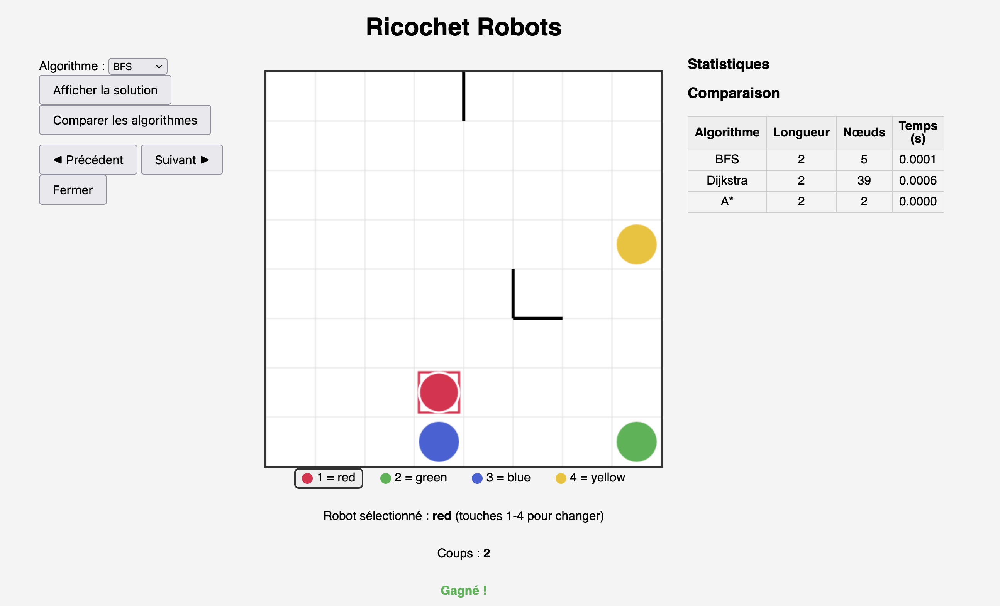

# Ricochet Robots — Simulateur & Solveur

Une plateforme web pour jouer au jeu de plateau *Ricochet Robots*, résoudre
n'importe quelle configuration avec plusieurs algorithmes de recherche, et
comparer leurs performances.

Dans *Ricochet Robots*, des robots glissent en ligne droite jusqu'à rencontrer
un mur ou un autre robot. Le but est d'amener un robot cible sur une case
d'arrivée en un nombre minimal de déplacements — un problème simple à énoncer
mais algorithmiquement riche.



## Fonctionnalités

- **Jouer** au clavier : déplacer chaque robot avec les touches fléchées,
  changer de robot avec les touches 1–4, essais illimités, réinitialisation.
- **Résoudre** une configuration avec trois algorithmes au choix : parcours en
  largeur (BFS), Dijkstra, et A*.
- **Prévisualiser** la solution pas à pas (boutons précédent / suivant) avec une
  flèche directionnelle indiquant le prochain coup, sans modifier la partie.
- **Comparer** les algorithmes côte à côte : longueur de la solution, nombre de
  nœuds explorés et temps de calcul.

## Architecture

Le projet sépare le **frontend** (le jeu, dans le navigateur) du **backend**
(l'API de résolution, en Python) :

- **Cœur logique** (`src/ricochet/`) : modèle de plateau, de partie, règle de
  glissement et solveurs, en Python pur et testé, indépendant de toute interface.
- **Backend / API** (`src/ricochet/api.py`) : une API FastAPI qui expose les
  configurations et la résolution au navigateur.
- **Frontend** (`web/`) : le plateau dessiné sur un canvas HTML, piloté au
  clavier, qui interroge l'API pour obtenir les solutions.

## Installation

Nécessite Python 3.11+.

```bash
python3 -m venv .venv
source .venv/bin/activate
python3 -m pip install -e ".[dev]"
```

## Lancement

La plateforme nécessite deux serveurs, dans deux terminaux.

Terminal 1 — le backend (API) :

```bash
python3 -m uvicorn ricochet.api:app --reload
```

Terminal 2 — le frontend (jeu) :

```bash
cd web
python3 -m http.server 5500
```

Ouvrir ensuite http://127.0.0.1:5500/ dans un navigateur.

## Comment ça marche

Un état de jeu est le tuple des positions des quatre robots ; un coup fait
glisser un robot jusqu'à ce qu'il soit bloqué. Les algorithmes explorent ce
graphe d'états implicite à la volée.

- BFS explore par vagues de profondeur croissante et fournit une solution
  optimale ; il sert de référence.
- Dijkstra utilise une file de priorité. Sur ce problème à coûts unitaires, il
  trouve la même solution optimale que le BFS, mais teste le but à l'extraction
  plutôt qu'à la découverte, ce qui l'amène à explorer davantage de nœuds.
- A* guide la recherche avec une heuristique admissible, ce qui lui permet
  d'explorer moins de nœuds tout en garantissant l'optimalité.

## Tests

```bash
pytest
```

## Licence

MIT
